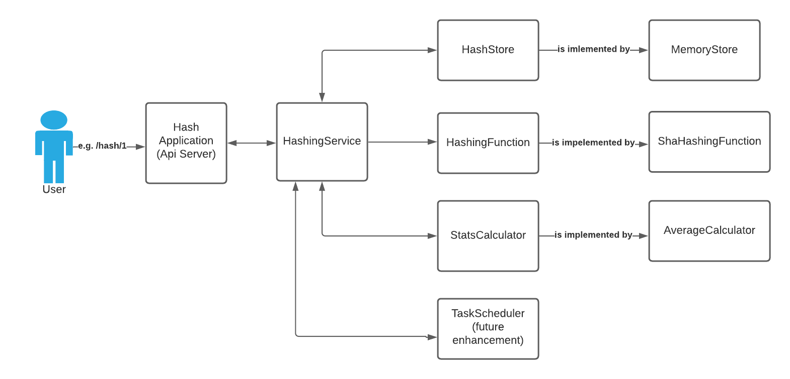

# Hash App
Application for hashing

# Functional Requirement
- Hash and encode password string
- Password should be hashed after 5 seconds
- Calculate average time for hash generation

# Non Functional Requirement
- App should be modular, it should be easy to switch between different flavors of implementation.
- App should be scalable
- App should have proper unit test coverage and good overall quality.

# High Level Diagram

# High Level Components
- **hashServer** - Implements all the apis.
- **hashingService** - Interface for all operations for hashing operations.
  The rest controller/hashServer will use this interface,
  to execute different operations for the app. This hashingService
  by default injects memoryStore (interface hashStore), shaHashingFunction (interface hashingFunction)
  and averageCalculator (interface StatsCalculator). But this can be easily modified by passing
  different implementation for hashStore, shaHashingFunction and StatsCalculator. Thus,
  we have modularized each and every dependency for this hashing service.
- **hashingFunction** - Interface for hashing function. Provides implementation for
  sha512 hashing. Other hashing implementation can also be provided.
- **hashStore** - Interface for hashStore. Provides default implementation
  for memoryStore. If we need to use other external db/store,
  we can implement this interface e.g. RedisStore, PostgresStore, etc.
- **statsCalculator** - Interface for statsCalculator.
  Provides implementation for default averageCalculator.
  Other different statsCalculator can be implemented later.

# Limitations
The current approach of delaying hash generation using sleep is not scalable. If we have thousands of
requests coming in, then there will be thousands of threads sleeping. To handle this situation we need to have
a taskScheduler that will submit task to in memory delay queue where items are sorted based on timestamp 
or pubsub topic with message delay (e.g. Apache Pulsar supports submitting message with
delay) or Redis delay queue which is sorted based on timestamp. This is a future enhancement.

# Resources

- https://medium.com/@matryer/5-simple-tips-and-tricks-for-writing-unit-tests-in-golang-619653f90742
- https://medium.com/honestbee-tw-engineer/gracefully-shutdown-in-go-http-server-5f5e6b83da5a
- https://www.section.io/engineering-education/build-a-rest-api-application-using-golang-and-postgresql-database/
- https://www.ribice.ba/rest-api-go3/
- https://golang.cafe/blog/golang-rest-api-example.html
